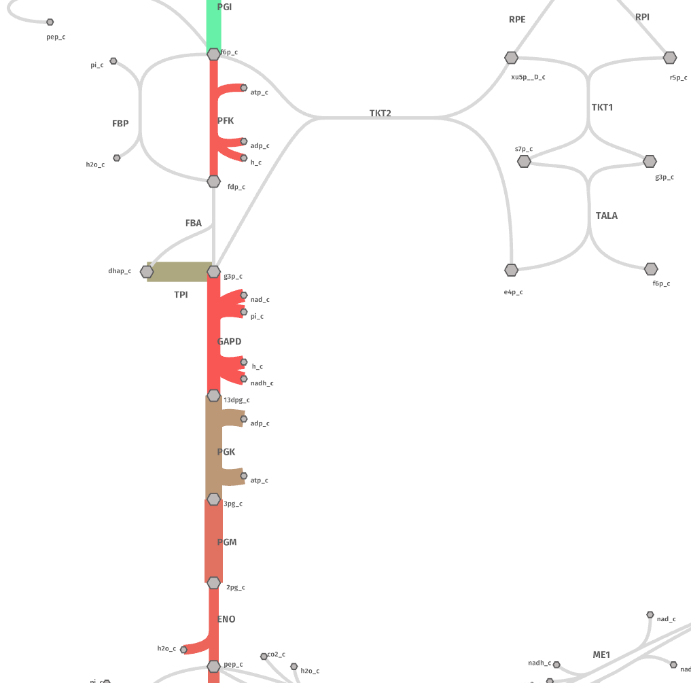
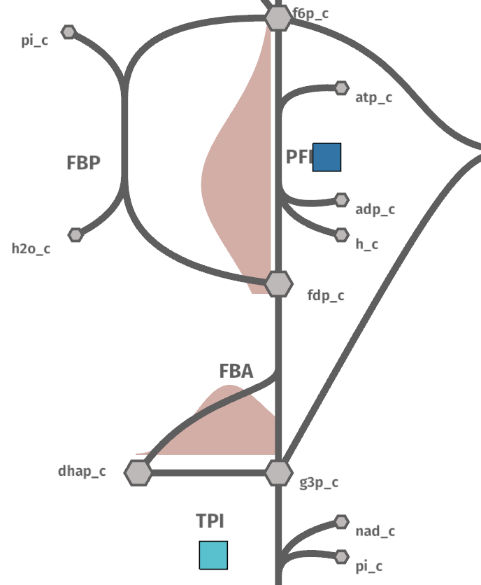
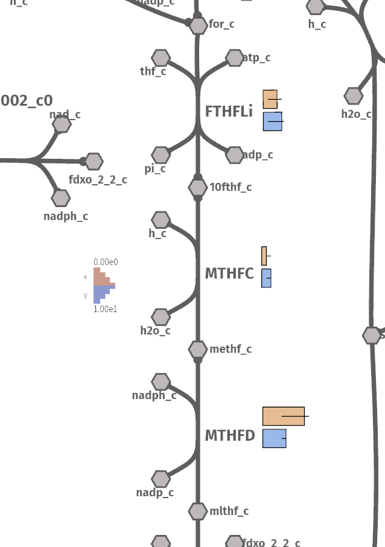
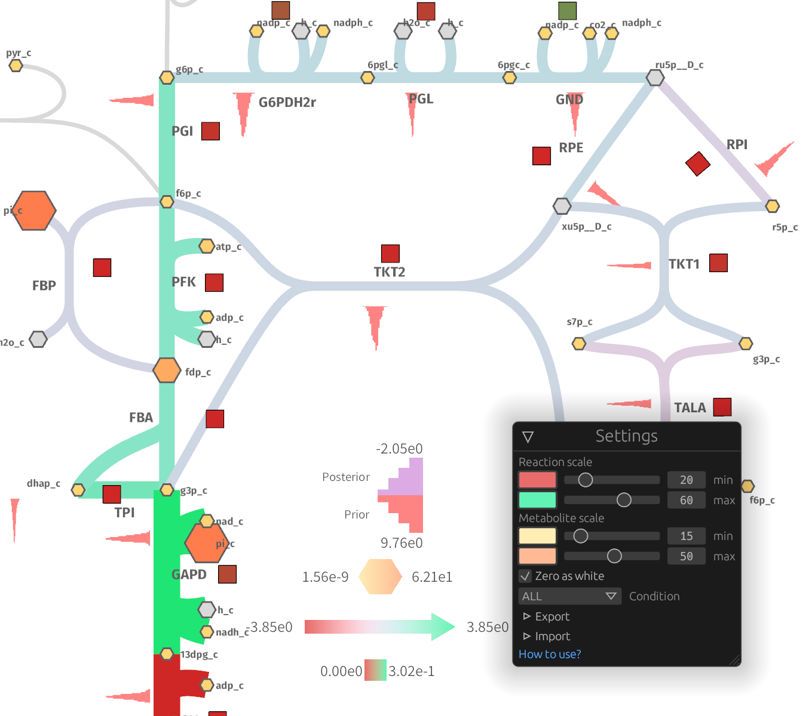
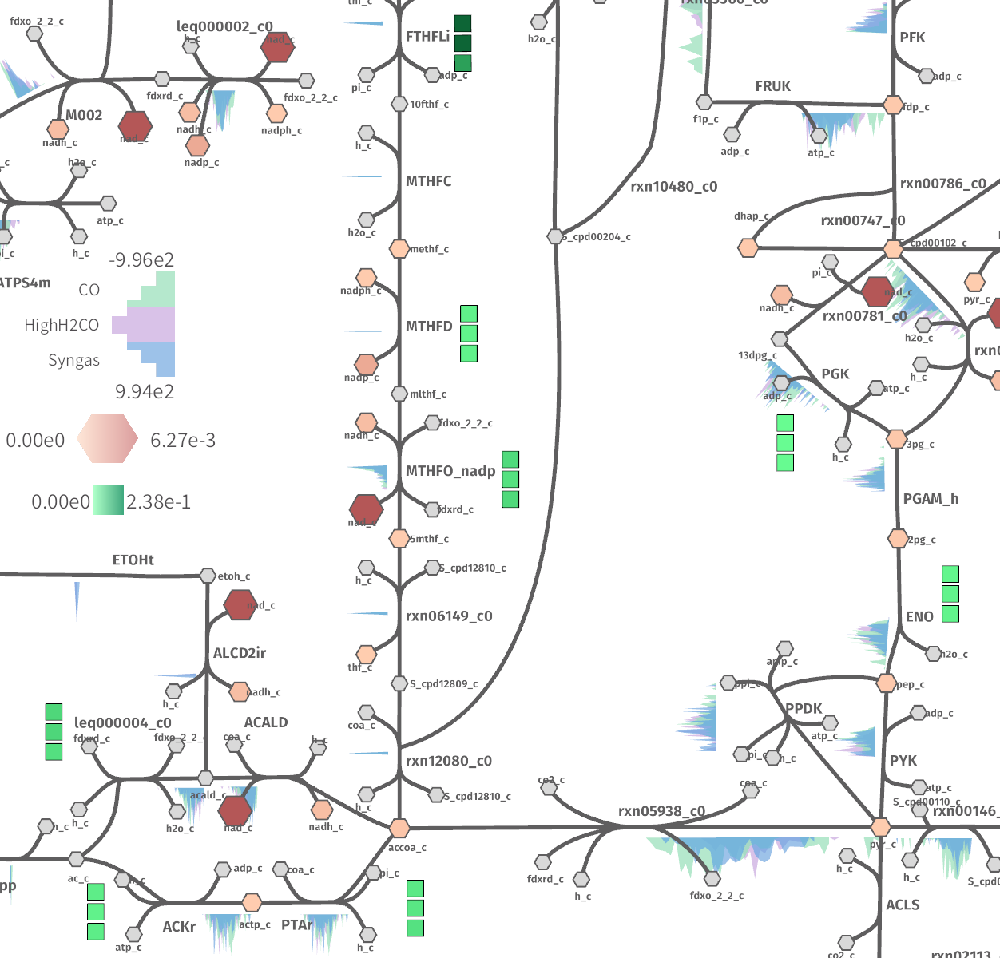

```python
import pandas as pd
from ggshu import aes, ggmap, geom_arrow

df = pd.DataFrame({
    "reactions": ["PFK", "ENO", "PYK", "GAPD", "PGI", "PGK", "PGM", "TPI"],
    "flux": [0.1, 0.2, 0.3, 0.4, 0.5, 0.6, 0.7, 0.8],
    "kcat": [20, 30, 40, 10, 200, 100, 50, 120]
})

(
    ggmap(df, aes(reaction="reactions", size="flux", color="kcat"))
    + geom_arrow()
)
```



```python
import pandas as pd
from ggshu import aes, ggmap, geom_kde, geom_boxpoint


df = pd.DataFrame({
    "reactions": ["PFK", "PFK", "PFK", "PFK", "PFK", "TPI", "TPI", "TPI", "TPI", "TPI"],
    "flux": [1.0, 2.0, 2.0, 2.0, 3.0, 5.0, 4.0, 3.0, 3.0, 3.0],
    "kcat": [20, 30, 40, 10, 200, 100, 50, 120, 120, 120]
})

(
    ggmap(df, aes(reaction="reactions", y="flux", color="kcat"))
    # distributions on the left side
    + geom_kde(side="left")
    # boxpoint (by default, on the right side)
    + geom_boxpoint()
)
```



```python
import pandas as pd
from ggshu import aes, ggmap, geom_column


df = pd.DataFrame({
    "reactions": ["MTHFC", "MTHFC", "FTHFLi", "FTHFLi", "MTHFD", "MTHFD"],
    "conditions": ["x", "y", "x", "y", "x", "y"],
    "flux": [1.0, 2.0, 3.0, 4.0, 9.0, 5.0],
    # if ymin/ymax are missing, the error bar in that direction is not plotted
    "flux_min": [None, 1.0, 1.0, 1.0, 4.0, 4.0],
    "flux_max": [2.0, None, 4.0, 4.5, 10.0, None]
})

plot = (
    ggmap(df, aes(y="flux", ymax="flux_max", ymin="flux_min", reaction="reactions"))
    + geom_column()
)
# save to JSON
plot.to_json("columnexp")
# alternatively, if in a jupyter notebook
# this must be in one cell
view = Shu(height=800)
view.show(offline=True)
# change the map in another cell
# cauto map: https://github.com/biosustain/shu_case_studies/blob/master/maps/cauto_map.json
with open("../../shu_case_studies/maps/cauto_map.json") as r:
    cauto_map = json.load(r)
    view.load_map(cauto_map)
# display the data
plot.show(view)
```



```url
**Check out** the [jupyter notebook](https://github.com/biosustain/shu_case_studies/blob/master/notebooks/1_shu_maud.ipynb).
```



```url
**Check out** the [jupyter notebook](https://github.com/biosustain/shu_case_studies/blob/master/notebooks/2_shu_omics.ipynb).
```
