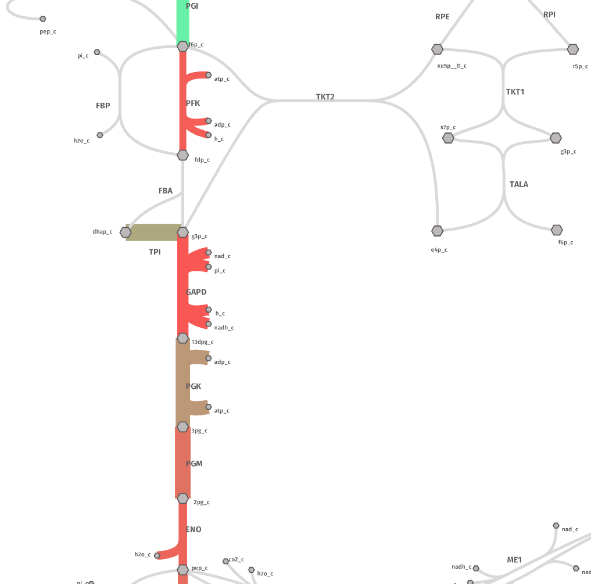
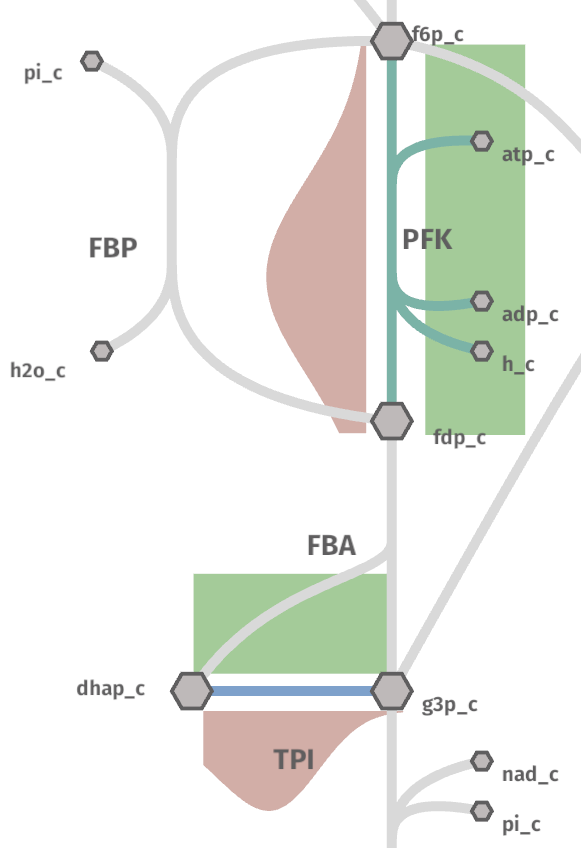
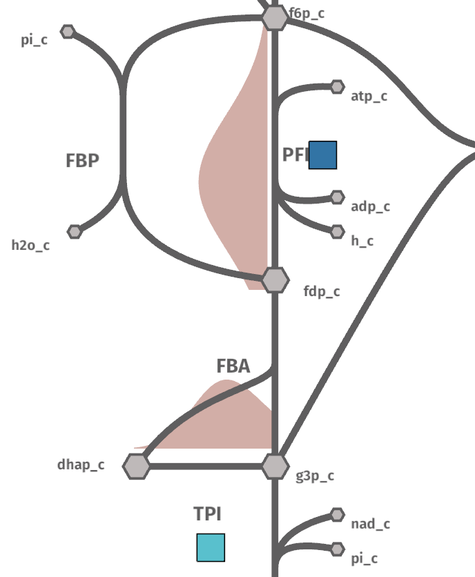

# Plotting

Drawing from the concepts of the Grammar of Graphics, shu allows to plot data
from a *variable* to different *geometrical* properties in the map. A
*variable* here could be the concentration of the metabolites in the cell and
the geometrical mapping - or *geom* - could be the size of the metabolite
nodes.

The grammar of shu is represented in the following figure:


To arrange the data in the correct format, a python package called ggshu can be
used to create the input for shu from a [pandas](http://pandas.pydata.org/) dataframe. It can be installed with `pip`:

```bash
python -m pip install ggshu
```

## Simple reaction example

First, we will use the [pandas](http://pandas.pydata.org/) library to create an example dataframe:

```python
import pandas as pd

df = pd.DataFrame({"reactions": ["PFK", "ENO", "PYK", "GAPD", "PGI", "PGK", "PGM", "TPI"],
                   "flux": [0.1, 0.2, 0.3, 0.4, 0.5, 0.6, 0.7, 0.8],
                   "kcat": [20, 30, 40, 10, 200, 100, 50, 120]})
```

Now, let's say we want to plot the flux as the size and colors of the arrows.

```python
from ggshu import aes, ggmap, geom_arrow

(
    ggmap(df, aes(reaction="reactions", size="flux", color="kcat"))
)
```

With this we are saying that the column `reactions` in the dataframe identifies the reactions
in the map, `df.flux` maps to the size and `df.kcat` to the color. Now, we only need to specify
which geometrical mapping to use; i.e., the size and color of what (histogram, arrow, nodes, etc.).

```python
(
    ggmap(df, aes(reaction="reactions", size="flux", color="kcat"))
    + geom_arrow()
)
```

Looking at the image at the top of this page, we can see that the arrow aesthetics take the size and color
as aesthetics, so we only needed to specificy the `geom_arrow()`. Finally, we can export the data as file
that can be used by shu.

```python
(
    ggmap(df, aes(reaction="reactions", size="flux", color="kcat"))
    + geom_arrow()
).to_json("flux_kcat")
```

The call to `to_json` will generate a file called `flux_kcat.metabolism.json` (which should look like this [data example](https://github.com/biosustain/shu/blob/master/assets/flux_kcat.metabolism.json)).

Now, go to the [shu website](https://biosustain.github.io/shu) and upload the file `flux_kcat.metabolism.json` and see the result by clicking on the.
rigth-top corner button "Data".

!!! warning
    If you are using the native application, you can also drag and drop the file into the application or use the import
    settings dropdown to write the full path manually.

The map should look like this:



!!! note
    Try tweaking the "Settings" window to achieve the same colors.

## Jupyter Notebooks

Instead of saving the file to JSON and loading it manually into Shu, **ggshu** can load Shu in a JupyterLab notebook and let you interact with it through Python.

Inside a notebook, create the same plot as before:

```python
plot = (
    ggmap(df, aes(reaction="reactions", size="flux", color="kcat"))
    + geom_arrow()
)
```

Next, load Shu into the notebook. This will download the necessary files under the hood (it may take a few seconds):

```python
from ggshu import Shu

shu_view = Shu(height=740)
shu_view.show()
```

To render your plot in the notebook, simply call the `show` method:

```python
plot.show(shu_view)
```

The visualization will appear in the cell where you called `shu_view.show()`.

!!! warning
    To conserve resources, shu renders lazily: it updates only when you interact with the app.
    If you don't see any changes, try hovering your cursor over the map!

## Plotting distributions

For the simple example, the shape of the dataframe did not really matter since
we had one value for each reaction. However, to plot more variables to
distribution geoms, it is important to understand that ggshu uses a dataframe
in [tidy format](https://vita.had.co.nz/papers/tidy-data.html).

The rows are the observations and the columns are the variables or features. This effectively means that a reaction
can appear in more than one row. Let's now plot some distributions.

```python
# the reactions do not need to be ordered!
df = pd.DataFrame({"reactions": ["PFK", "PFK", "PFK", "PFK", "PFK", "TPI", "TPI", "TPI", "TPI", "TPI"],
                   "flux": [1.0, 2.0, 2.0, 2.0, 3.0, 5.0, 4.0, 3.0, 3.0, 3.0],
                   "kcat": [20, 30, 40, 10, 200, 100, 50, 120, 120, 120]})
```

Since we now have distributions, plotting the data as the color would allow only to use the mean or any other
summary statistics per reaction. This loses a lot of information. Luckily, we can use an histogram or a density instead!

```python
from ggshu import aes, ggmap, geom_hist

(
    # notice the change in the aesthetics!
    ggmap(df, aes(reaction="reactions", y="kcat"))
    # plot kcats as the y-axis of the histograms
    + geom_hist()
)
```

But we have not plotted the flux! We can plot them as, for instance, a density on the left side of the reactions.

```python
from ggshu import geom_kde

(
    ggmap(df, aes(reaction="reactions", y="kcat"))
    + geom_hist()
    # by default, side is "right"
    + geom_kde(aes=aes(y="flux"), side="left")
)
```

Notice how, instead of using (inheriting) the initial aesthetics, we are overwriting them for the `geom_kde` mapping.
Still, to give an impression of the mean, we can plot the color and size of the arrows as the flux.

```python
(
    # notice the change in the aesthetics!
    ggmap(df, aes(reaction="reactions", y="kcat", color="flux"))
    + geom_hist()
    + geom_arrow()
    + geom_kde(aes=aes(y="flux"), side="left")
).to_json("flux_kcat_dist")
```

!!! warning

    Distribution data (where one reaction/metabolite appears more than once in the column) will be coerced to the mean when used with a `geom_arrow` or a `geom_metabolite`.

The generated file `flux_kcat_dist.metabolism.json` can be used like before at [shu website](https://biosustain.github.io/shu).



Notice how, there is not enough data to generate a meaningful histogram.

## Histogram position

Shu tries to fit the best plotting position next to the arrows with an heuristic
but it may fail for some reactions. 

Try pressing right or middle mouse button in the middle of a histogram to
*rotate* or *move* it. If an x-axis of the side plots is too big or too small, press
`s` and the x-axes will be displayed. In this mode, the behavior of right clicks
is changed to now *scale* the axes.

After moving, rotating and scaling the axes as desired, all these new coordinates
can be saved to a new map in the settings window (only available for the desktop
app) for futures shu sessions.

An SVG image of the map can also be exported through the settings window (for all
platforms and the web). PNG/JPEG/BMP/TGA are also supported if the provided paths
have one of their corresponding extensions.

## Hover

Instead of plotting a distribution on the right or the left side we can put the plot
on a popup that appears when hovering over the name of the reaction or a metabolite.

Try the example from before but change the side in the kde or in the histogram. For instance:

```python
    + geom_hist(side="hover")
```

## Plotting metabolites and conditions

So far we have been plotting only reactions, but the nodes on the map (i.e., metabolites)
can be used to map the data too! For instance:

```python
(
    ggmap(
        df_cond,
        aes(reaction="r", color="flux", size="flux", condition="cond", y="kcat"),
    )
    # plot flux to color and size of reactions
    + geom_arrow()
    # plot kcat as histogram shows on left side of reactions
    + geom_hist(side="left")
    # plot conc to color of metabolites
    + geom_metabolite(aes=aes(color="conc", metabolite="m"))
    # plot km as density plots shows on hover on metabolites
    + geom_kde(aes=aes(y="km"), mets=True)
).to_json("shu_data")
```

Notice that now we have specified a new aesthetics: `condition`. Shu will show a dropdown in settings to plot this kind of data.

## Using two dataframes

In the previous section, we used a dataframe called `df_cond`. To make it work like that,
`df_cond.conditions` has to be aligned with both reactions and metabolites. Usually, this is not easy, so ggshu provides a way to generate the reaction mapping and metabolite mapping separetely and then merge it by using the division `/` operator.

```python
reaction_map = (
    ggmap(
        df_reactions,
        aes(reaction="r", color="flux", size="flux", condition="cond", y="kcat"),
    )
    # plot flux to color and size of reactions
    + geom_arrow()
    # plot kcat as histogram shows on left side of reactions
    + geom_hist(side="left"))
)
metabolite_map = (ggmap(
        df_metabolites,
        aes(metabolite="m", color="conc", y="km", condition="cond"),
    )
    # plot conc to color of metabolites
    + geom_metabolite(aes=aes(color="conc", metabolite="m"))
    # plot km as density plots shows on hover on metabolites
    + geom_kde(aes=aes(y="km"), mets=True))
)
(reaction_map / metabolite_map).to_json("shu_data")
```

## Point estimates on the sides

Sometimes distributed data is not available but we have different variables that we want to plot into a reaction. We can use `geom_boxpoint()` to plot this kind of data (also works with conditions):

```python
from ggshu import geom_boxpoint

(
   # this is the same dataframe as in the distribution example
    ggmap(df, aes(reaction="reactions", y="flux", color="kcat"))
    + geom_kde(side="left")
    # instead of geom_arrow, use a boxpoint
    + geom_boxpoint()
).to_json("flux_kcat_dist")
```



## Data Format

If `ggshu` is not enough, you can check the lower level data format that shu uses (the ouput that `ggshu` generates) in the [file_formats](file_formats.md) section.
