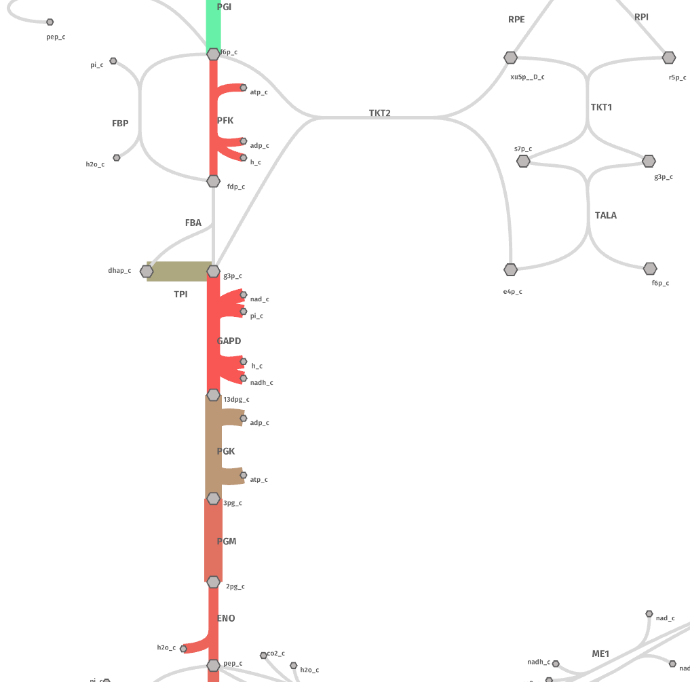
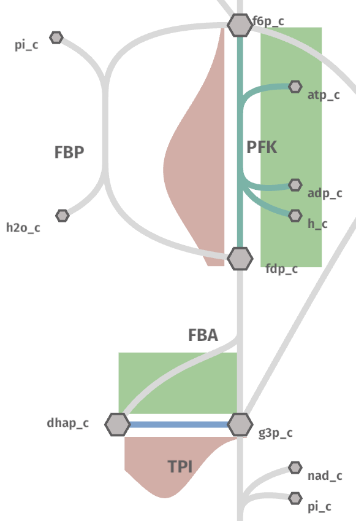
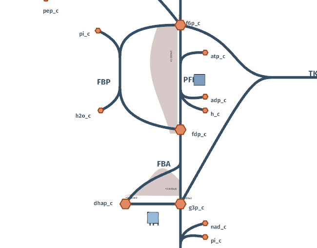

Plotting
========

Drawing from the concepts of the Grammar of Graphics, shu allows to plot data
from a *variable* to different *geometrical* properties in the map. A
*variable* here could be the concentration of the metabolites in the cell and
the geometrical mapping - or *geom* - could be the size of the metabolite
nodes.

The grammar of shu is represented in the following figure:

.. image:: img/schema.png
  :alt: Shu grammar graphics schema.

To arrange the data in the correct format, a python package called ggshu can be
used to create the input for shu from a `pandas`_ dataframe. It can be installed with ``pip``:

.. code-block:: bash

  python -m pip install ggshu

Simple reaction example
-----------------------

First, we will use the `pandas`_ library to create an example dataframe:

.. code-block:: python

   import pandas as pd

   df = pd.DataFrame({"reactions": ["PFK", "ENO", "PYK", "GAPD", "PGI", "PGK", "PGM", "TPI"],
                      "flux": [0.1, 0.2, 0.3, 0.4, 0.5, 0.6, 0.7, 0.8],
                      "kcat": [20, 30, 40, 10, 200, 100, 50, 120]})

Now, let's say we want to plot the flux as the size and colors of the arrows.

.. code-block:: python

   from ggshu import aes, ggmap, geom_arrow

   (
       ggmap(df, aes(reaction="reactions", size="flux", color="kcat"))
   )

With this we are saying that the column ``reactions`` in the dataframe is the identifies the reactions
in the map, ``df.flux`` is map to the size and ``df.kcat`` to the color. Now, we only need to specify
which geometrical mapping; i.e., the size and color of what (histogram, arrow, nodes, etc.).

.. code-block:: python

   (
       ggmap(df, aes(reaction="reactions", size="flux", color="kcat"))
       + geom_arrow()
   )

Looking at the image at the top of this page, we can see that the arrow aesthetics take the size and color
and aesthetics, so we only needed to specificy the ``geom_arrow()``. Finally, we can export the data as file
that can be used by shu.

.. code-block:: python

   (
       ggmap(df, aes(reaction="reactions", size="flux", color="kcat"))
       + geom_arrow()
   ).to_json("flux_kcat")

The call to ``to_json`` will generate a file called `flux_kcat.metabolism.json`.

Now, go to the `shu website`_ and upload the file `flux_kcat.metabolism.json` and see the result by clicking on the.
rigth-top corner button "Data".

.. warning::
  If you are using the native application, you can also drag and drop the file into the application or use the import
  settings dropdown to write the full path manually.

The map should look like this:

Plotting distributions
----------------------

For the simple example, it did not really matter since we had one value for each reaction. However, to plot
more variables to distribution geoms, it is important to understand that ggshu uses a dataframe in `tidy format`_.

The rows are the observations and the columns are the variables or features. This effectively means that a reaction
can appear in more than one row. For the size and color of ``geom_arrow()`` this did not matter because distributions get coerced to their mean, but let's try
now to plot distributions.

.. code-block:: python

   # the reactions do not need to be ordered!
   df = pd.DataFrame({"reactions": ["PFK", "PFK", "PFK", "PFK", "PFK", "TPI", "TPI", "TPI", "TPI", "TPI"],
                      "flux": [1.0, 2.0, 2.0, 2.0, 3.0, 5.0, 4.0, 3.0, 3.0, 3.0],
                      "kcat": [20, 30, 40, 10, 200, 100, 50, 120, 120, 120]})

Since we now have distributions, plotting the data as the color would allow only to use the mean or any other
summary statistics per reaction. This loses a lot of information. Luckily, we can use an histogram or a density instead!

.. code-block:: python

   from ggshu import aes, ggmap, geom_hist

   (
       # notice the change in the aesthetics!
       ggmap(df, aes(reaction="reactions", y="kcat"))
       + geom_hist()
   )

But we have not plotted the flux! We can plot them as, for instance, a density on the left side of the reactions.

.. code-block:: python

   from ggshu import geom_kde

   (
       ggmap(df, aes(reaction="reactions", y="kcat"))
       + geom_hist()
       # by default, side is "right"
       + geom_kde(aes=aes(y="flux"), side="left")
   )

Notice how, instead of using (inheriting) the initial aesthetics, we are overwriting them for the ``geom_kde`` mapping.
Still, to give an impression of the mean, we can plot the color and size of the arrows as the flux.

.. code-block:: python

   (
       # notice the change in the aesthetics!
       ggmap(df, aes(reaction="reactions", y="kcat", color="flux"))
       + geom_hist()
       + geom_arrow()
       + geom_kde(aes=aes(y="flux"), side="left")
   ).to_json("flux_kcat_dist")

.. warning::

   Distribution data (where one reaction/metabolite appears more than once in the column) will be coerced to the mean when used with a `geom_arrow` or a `geom_metabolite`.

The generated file `flux_kcat_dist.metabolism.json` can be used like before at `shu website`_.

There is not enough data to generate a meaningful histogram.

.. note::

   The histograms can be dragged and rotated with the middle and right clicks. Shu tries to fit the best position with an heuristic but it may fail for some reactions.

Hover
-----

Instead of plotting a distribution on the right or the left side we can put the plot
on a popup that appears when hovering over the name of the reaction or a metabolite.

Try the example from before but change the side in the kde or in the histogram. For instance:

.. code-block:: python

       + geom_hist(side="hover")

Plotting metabolites and conditions
-----------------------------------

So far we have been plotting only reactions, but the nodes on the map (i.e., metabolites)
can be used to map the data too! For instance:

.. code-block:: python

    (
        ggmap(
            df_cond,
            aes(reaction="r", color="flux", size="flux", condition="cond", y="kcat"),
        )
        # plot flux to color and size of reactions
        + geom_arrow()
        # plot kcat as histogram shows on left side of reactions
        + geom_hist(side="left")
        # plot conc to color of metabolites
        + geom_metabolite(aes=aes(color="conc", metabolite="m"))
        # plot km as density plots shows on hover on metabolites
        + geom_kde(aes=aes(y="km"), mets=True)
    ).to_json("shu_data")

Notice that now we have specified a new aesthetics: `condition`. Shu will show a dropdown in settings to plot this kind of data.

Using two dataframes
--------------------

In the previous section, we used a dataframe called ``df_cond``. To make it work like that,
df_cond conditions has to be aligned with both reactions and metabolites. Usually, this is not easy, so ggshu provides a way to generate the reaction mapping and metabolite mapping separetely and then merge it by using the division `/` operator.

.. code-block:: python

    reaction_map = (
        ggmap(
            df_reactions,
            aes(reaction="r", color="flux", size="flux", condition="cond", y="kcat"),
        )
        # plot flux to color and size of reactions
        + geom_arrow()
        # plot kcat as histogram shows on left side of reactions
        + geom_hist(side="left"))
    )
    metabolite_map = (ggmap(
            df_metabolites,
            aes(metabolite="m", color="conc", y="km", condition="cond"),
        )
        # plot conc to color of metabolites
        + geom_metabolite(aes=aes(color="conc", metabolite="m"))
        # plot km as density plots shows on hover on metabolites
        + geom_kde(aes=aes(y="km"), mets=True))
    )
    (reaction_map / metabolite_map).to_json("shu_data")

Point estimates on the sides
----------------------------
Sometimes distributed data is not available but we have different variables that we want to plot into a reaction. We can use ``geom_boxpoint()`` to plot this kind of data (also works with conditions):

.. code-block:: python

   from ggshu import geom_boxpoint

   (
      # this is the same dataframe as in the distribution example
       ggmap(df, aes(reaction="reactions", y="flux", color="kcat"))
       + geom_kde(side="left")
       # instead of geom_arrow, use a boxpoint
       + geom_boxpoint()
   ).to_json("flux_kcat_dist")

Data Format
-----------

If `ggshu` is not enough, you can check the lower level data format that shu uses (the ouput that `ggshu` generates) in the `API documentation`_.

.. _pandas: http://pandas.pydata.org/
.. _tidy format: https://vita.had.co.nz/papers/tidy-data.html 
.. _shu website: https://biosustain.github.io/shu
.. _API documentation: https://docs.rs/shu/latest/shu/data/struct.Data.html
